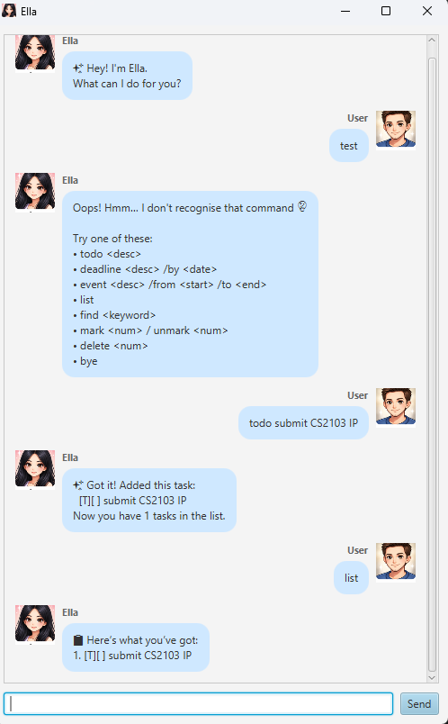

# Ella User Guide

Ella is a lightweight task manager chatbot with a GUI.

## Quick start
1. Run the app.
2. Type commands in the input box and press **Enter** (or click **Send**).

## Features

### Add a todo
Format: 	Todo DESCRIPTION

Example:
- 	Todo read CS2103T notes

### Add a deadline
Format: deadline DESCRIPTION /by DATE

Example:
- deadline submit iP /by 2026-02-20

### Add an event
Format: event DESCRIPTION /from START /to END

Example:
- event project meeting /from 2026-02-19 1400 /to 2026-02-19 1600

### List tasks
Format: list

### Mark / unmark task
Format:
- mark INDEX
- unmark INDEX

Example:
- mark 1

### Delete task
Format: delete INDEX

Example:
- delete 2

### Find tasks
Format: ind KEYWORD

Example:
- ind meeting

### Sort tasks
Format: sort

### Exit
Format: ye

## Error handling
- Ella shows friendly error messages for unknown commands, missing arguments, and invalid task numbers.
- If the save file is missing, Ella starts with an empty task list and continues normally.
